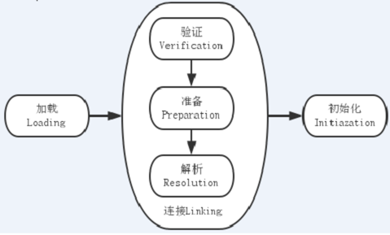

# 1 前言
JVM类加载过程   https://www.cnblogs.com/xiaoxian1369/p/5498817.html

Class文件是如何被加载进JVM的？一篇图文带你彻底弄懂  https://www.toutiao.com/i6795914916239770115/

Class.forName和ClassLoader区别   https://www.toutiao.com/i6802075127845487116/

# 2 Java类加载过程
类从被加载到JVM中开始，到卸载为止，整个**生命周期**包括：加载、验证、准备、解析、初始化、使用和卸载七个阶段。

其中**类加载过程**占了7个中的5个阶段，包括：加载、验证、准备、解析和初始化，剩下的使用和卸载不适于加载过程。

可见，类加载过程，可以划分为三个部分：加载、链接、初始化，下文从这个三个部分分别介绍。

## 2.1 加载
通过类加载器从以classpath为根路径，以类的全量名为相对路径读取字节码文件。

简单的说，类加载阶段就是由类加载器负责根据一个类的全限定名来读取此类的二进制字节流到JVM内部，并存储在运行时内存区的方法区，然后将其转换为一个与目标类型对应的java.lang.Class对象实例（Java虚拟机规范并没有明确要求一定要存储在堆区中，只是hotspot选择将Class对象存储在方法区中），这个Class对象在日后就会作为方法区中该类的各种数据的访问入口。

类加载器其实也是Java类，从父类到子类，层级关系由上往下是：

* BootstrapClassLoader，能够读取的字节码路径包括：JRE、lib、rt.jar
* ExtClassLoader，能够读取的字节码路径包括：JRE、lib、ext、*.jar
* AppClassLoader，能够读取的字节码路径包括：classpath指定的所有jar和目录
* （自定义的类加载器，没自定义就没这一层）

最后，defineClass方法将字节码的byte数组转换为一个类的class对象实例，如果希望在类被加载到JVM时就被链接，那么可以调用resolveClass方法。

自定义类加载器需要继承抽象类ClassLoader，实现findClass方法，该方法会在loadClass方法调用的时候被调用，findClass默认会抛出异常。

findClass方法表示根据类名查找类对象字节码文件

loadClass方法表示根据类名进行**双亲委托模型**进行类加载并返回Class对象

defineClass方法表示跟根据类的字节码转换为类对象

### 2.1.1 双亲委派模型
双亲委托模型，约定了类加载器的加载机制。理解双亲委派，对理解通过命令行的方式启动java程序，有很大的帮助。

双亲委托模型的工作过程是：

如果一个类加载器收到了类加载的请求，它首先不会自己去尝试加载这个类，而是把这个请求委托给父类加载器去完成，每一个层次的类加载器都是如此，因此所有的加载请求最终都应该传送到顶层的启动类加载器中，只有当父类加载器反馈自己无法完成这个加载请求（它的搜索范围中没有找到所需要加载的类）时，子加载器才会尝试自己去加载。

每个层级的类加载器都有自己的能加载的字节码文件的范围，上文已经提到，此处再强调一下：

* BootstrapClassLoader，能够读取的字节码路径包括：JRE、lib、rt.jar
* ExtClassLoader，能够读取的字节码路径包括：JRE、lib、ext、*.jar
* AppClassLoader，能够读取的字节码路径包括：classpath指定的所有jar和目录
* （自定义的类加载器，没自定义就没这一层）

使用双亲委托机制的好处是：能够有效确保一个类的全局唯一性，当程序中出现多个限定名相同的类时，类加载器在执行加载时，始终只会加载其中的某一个类。因为，父类能加载，加载任务就不会再向下传递，避免了几个层级同时加载时，出现冲突的情况。

比如，类java.lang.Object，它**存放在rt.jar之中，无论哪一个类加载器要加载这个类，最终都是委托给处于模型最顶端的启动类加载器进行加载**，因此Object类在程序的各种加载器环境中都是同一个类。相反，如果没有使用双亲委托模型，由各个类加载器自行去加载的话，如果用户自己编写了一个称为java.lang.Object的类，并放在程序的ClassPath中，那系统中将会出现多个不同的Object类，Java类型体系中最基础的行为也就无法保证，应用程序也将会变得一片混乱。如果自己去编写一个与rt.jar类库中已有类全量类名重名的Java类，将会发现可以正常编译，但该自定义的类永远无法被加载运行。

双亲委托模型对于保证Java程序的稳定运作很重要，但它的实现却非常简单，实现双亲委托的代码都集中在java.lang.ClassLoader的loadClass()方法中，逻辑清晰易懂：

1. 先检查是否已经被加载过，若没有加载则调用父类加载器的loadClass()方法
2. 若父加载器为空则默认使用启动类加载器（bootstrapcClassloader）作为父加载器。
3. 如果父类加载器加载失败，抛出ClassNotFoundException异常后，再调用自己的findClass方法进行加载。

因此，加载这一步的成果是，根据class文件，成对了对应的Class对象到方法区。

## 2.2 链接
链接阶段要做的是将加载到JVM中的二进制字节流的类数据信息合并到JVM的运行时状态中，经由验证、准备和解析三个阶段。

1）、验证
验证类数据信息是否符合JVM规范，是否是一个有效的字节码文件，验证内容涵盖了类数据信息的格式验证、语义分析、操作验证等。

格式验证：验证是否符合class文件规范

语义验证：检查一个被标记为final的类型是否包含子类；检查一个类中的final方法是否被子类进行重写；确保父类和子类之间没有不兼容的一些方法声明（比如方法签名相同，但方法的返回值不同）

操作验证：在操作数栈中的数据必须进行正确的操作，对常量池中的各种符号引用执行验证（通常在解析阶段执行，检查是否通过符号引用中描述的全限定名定位到指定类型上，以及类成员信息的访问修饰符是否允许访问等）

2）、准备
为类中的所有**静态变量**分配内存空间，并为其设置一个初始值（由于还没有产生对象，实例变量不在此操作范围内）
被final修饰的静态变量，会直接赋予原值；类字段的字段属性表中存在ConstantValue属性，则在准备阶段，其值就是ConstantValue的值

3）、解析
将常量池中的符号引用转为直接引用（得到类或者字段、方法在内存中的指针或者偏移量，以便直接调用该方法），这个可以在初始化之后再执行。

可以认为是一些静态绑定的会被解析，动态绑定则只会在运行时进行解析；静态绑定包括一些final方法(不可以重写),static方法(只会属于当前类)，构造器(不会被重写)。

## 2.3 初始化

**将一个类中所有被static关键字标识的代码统一执行一遍**，如果执行的是静态变量，那么就会使用用户指定的值**覆盖之前在准备阶段设置的初始值**；如果执行的是static代码块，那么在初始化阶段，JVM就会执行static代码块中定义的所有操作。

所有类变量初始化语句和静态代码块都会在编译时被前端编译器放在收集器里头，存放到一个特殊的方法中，这个方法就是clinit方法，即类/接口初始化方法。该方法的作用就是初始化一个类中的变量，使用用户指定的值覆盖之前在准备阶段里设定的初始值。任何invoke之类的字节码都无法调用clinit方法，因为该方法只能在类加载的过程中由JVM调用。

如果父类还没有被初始化，那么优先对父类初始化，但在clinit方法内部不会显式调用父类的clinit方法，**由JVM负责保证一个类的clinit方法执行之前，它的父类clinit方法已经被执行**。

JVM必须确保一个类在初始化的过程中，如果是多线程需要同时初始化它，仅仅只能允许其中一个线程对其执行初始化操作，其余线程必须等待，只有在活动线程执行完对类的初始化操作之后，才会通知正在等待的其他线程。