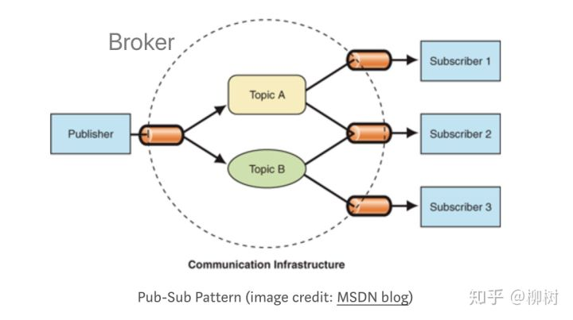

# 1 前言

参考文章：

Java基础类库之Observable   https://blog.csdn.net/qq_18948359/article/details/89893576

观察者模式对比订阅模式   https://zhuanlan.zhihu.com/p/51357583

Java 9：Observer和Observable废弃原因及解决方案    https://majing.io/posts/10000001281162


# 2 JDK实现源码及代码实践
直接看被观察者通知观察者的源码：

```java
    public void notifyObservers(Object arg) {
        /*
         * a temporary array buffer, used as a snapshot of the state of
         * current Observers.
         */
        Object[] arrLocal;

        synchronized (this) {
            /* We don't want the Observer doing callbacks into
             * arbitrary code while holding its own Monitor.
             * The code where we extract each Observable from
             * the Vector and store the state of the Observer
             * needs synchronization, but notifying observers
             * does not (should not).  The worst result of any
             * potential race-condition here is that:
             * 1) a newly-added Observer will miss a
             *   notification in progress
             * 2) a recently unregistered Observer will be
             *   wrongly notified when it doesn't care
             */

            if (!changed)
                return;
            arrLocal = obs.toArray();
            clearChanged();
        }

        for (int i = arrLocal.length-1; i>=0; i--)
            ((Observer)arrLocal[i]).update(this, arg);
    }
```

可见：

1. 被观察者是否发送通知，取决于变量change；发送通知后，change状态会被自动清除（clearChange）
2. 观察者的update方法其实是被 被观察者 直接调用的，是阻塞式的通知
3. 有一定的线程安全问题，在for循环中发送通知的过程中，下一个变更已经发生，则发送的arg对象引用，可能已经跟一开始的发生变化了，即，**arg始终是最新的，而不是通知发生时的拷贝，高速更新+大量观察者时会有一定的差别**


## 2.1 观察者模式代码实践
被观察者是房子，观察者是购房人，当房价发生变化时，购房者会收到最新的房价信息。代码实现基于类Observable和接口Observer。

被观察者，House类

```java
package com.jeasonchan.dailyexercise.观察者模式实践;

import lombok.Getter;

import java.util.Observable;

public class House extends Observable {
    @Getter
    private String houseName = "House";

    @Getter
    private int price = 0;


    public void setPrice(int newPrice) {
        this.price = newPrice;

        //更改标志，设置已变更状态
        //下一步才能根据已变更的状态发送变量
        super.setChanged();

        //传递想被监控到的变化对象
        super.notifyObservers(newPrice);

    }

    @Override
    public String toString() {
        return "House{" +
                "houseName='" + houseName + '\'' +
                ", price=" + price +
                '}';
    }
}
```

观察者，HouseBuyer

```java
package com.jeasonchan.dailyexercise.观察者模式实践;

import java.util.Observable;
import java.util.Observer;

public class HouseBuyer implements Observer {


    @Override
    public void update(Observable o, Object arg) {


        System.out.println("被观察的对象是：" + o +
                "被观察者通知的内容是：" + arg);


    }
}
```

测试类Controller

```java
package com.jeasonchan.dailyexercise.观察者模式实践;

import java.util.HashMap;
import java.util.Map;

public class ObserverController {

    public static void main(String[] args) {

        HouseBuyer houseBuyer = new HouseBuyer();

        House house = new House();
        
        //将观察者添加进待通知的列表
        house.addObserver(houseBuyer);

        for (int i = 0; i < 10; ++i) {
            System.out.println("设置房价为：" + i);
            
            //一设置新房价，购房者就会收到通知
            house.setPrice(i);
        }


    }


}
```


# 3 和订阅模式进行比较
大概很多人都和我一样，觉得发布订阅模式里的Publisher，就是观察者模式里的Observable（被观察类），而Subscriber，就是Observer接口。Publisher变化时，就主动去通知Subscriber，也就像被观察者一样，直接在底层挨个调观察者的update接口。

其实并不是！！！！

在发布订阅模式里，发布者，并不会直接通知订阅者，更不会直接调订阅者的实例的方法，而是，通过第三者，也就是在消息队列里面，我们常说的经纪人Broker。




如上图所示，发布者只需告诉Broker，我要发的消息所属的topic是A；

订阅者只需告诉Broker，我要订阅的topic是A；

于是，当Broker收到发布者发过来消息，并且topic是A时，就会把消息推送给订阅了topic A的订阅者。**当然也有可能是订阅者自己过来拉取，看具体实现**。

**也就是说，发布订阅模式里，发布者和订阅者，不是松耦合，而是完全解耦的。**

## 3.1 对比小结
* 从表面上看

观察者模式里，只有两个角色 —— 观察者 + 被观察者

而发布订阅模式里，却不仅仅只有发布者和订阅者两个角色，还有一个经常被我们忽略的 —— 代理人Broker

* 往更深层次讲：

观察者和被观察者，是松耦合的关系

发布者和订阅者，则完全不存在耦合

* 从使用层面上讲：

观察者模式，多用于单个应用内部

发布订阅模式，则更多的是一种跨应用的模式(cross-application pattern)，比如我们常用的消息中间件kafka

# 4 Java 9中被废弃的原因及替代方案

Observer接口和Observable类从Java 9标记为废弃。

## 4.1 废弃原因

1. 不能序列化

Observable没有实现Serializable接口，Observable的内部成员变量都是私有的，子类不能通过继承Observable来对Observable的成员变量处理,只能调用一些方法。

同时子类为了实现通知功能，必定会调用setChanged和notifyObservers方法，而Observable类无法被序列化，子类注定也无非被序列化了，要是能序列化也只能得到json串，得不到方法。


2. 不是线程安全

在 java.util.Observable文**档里没有强制要求Observable是线程安全的**，它允许子类覆盖重写Observable的方法，也允许事件通知无序以及事件通知发生在不同的线程里，这些都是会潜在的影响线程安全的问题。

如下：

```java
    public void notifyObservers(Object arg) {
        /*
         * a temporary array buffer, used as a snapshot of the state of
         * current Observers.
         */
        Object[] arrLocal;

        synchronized (this) {

            if (!changed)
                return;
            arrLocal = obs.toArray();
            clearChanged();
        }

        for (int i = arrLocal.length-1; i>=0; i--)
            ((Observer)arrLocal[i]).update(this, arg);
    }
```

可见，同步块只能保证change变量的改变是线程安全的，而arg作为对象的引用，真正开始通知时可能已经有变化了很多次了，除非是基础变量。


3. 支持事件模型的功能简单

支持事件模型的功能很简单，例如，只是支持事情发生变化的概念，但是不能提供更多哪些内容发生了改变。

参考：deprecate Observer and Observable


## 4.2 解决方案
可以使用java.beans 里的PropertyChangeSupport、PropertyChangeEvent 和 PropertyChangeListener 来代替目前Observer和Observable的功能。

PropertyChangeSupport相当于被观察者，PropertyChangeEvent是事件，PropertyChangeListener是观察者。代码实践如下：


```java
public class Demo {  
  
  private String name;  
  private PropertyChangeSupport listeners = new PropertyChangeSupport(this);  
    
  public Demo() {  
      this.name= "my name";  
  }  

  public String getName() {  
      return this.name;  
  }  
      
  public void setName(String name) {  
      String oldValue = this.name;  
      this.name= name;  
      //发布监听事件  
      firePropertyChange("name", oldValue, demoName);  
  }  
      
  public void addPropertyChangeListener(PropertyChangeListener listener) {  
      listeners.addPropertyChangeListener(listener);  
  }  
      
  public void removePropertyChangeListener(PropertyChangeListener listener){  
      listeners.removePropertyChangeListener(listener);  
  }  
      
  protected void firePropertyChange(String prop, Object oldValue, Object newValue) {  
      listeners.firePropertyChange(prop, oldValue, newValue);  
  }  
}

public class Main {  
  public static void main(String[] args) {  
    Demo demo= new Demo();  
     demo.addPropertyChangeListener(new PropertyChangeListener(){  
      public void propertyChange(PropertyChangeEvent evt) {  
         System.out.println("OldValue:"+evt.getOldValue());  
        System.out.println("NewValue:"+evt.getNewValue());  
        System.out.println("tPropertyName:"+evt.getPropertyName());  
    }});  
     demo.setName("new Name");  
  }  
}
```