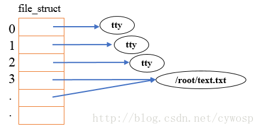

# 1 前言
参考文章：

文件描述符和socket连接    https://www.cnblogs.com/DengGao/p/file_symbol.html

Stream Socket 和 Datagram socket    https://www.xuebuyuan.com/1170964.html

TCP连接数和文件描述符用尽   https://blog.csdn.net/tsh123321/article/details/88990825


一直很好奇，sokcet的连接在关闭时，做了什么动作？数据库的连接池（个人觉得，本质就是基于socket实现了数据库的私有协议），为什么threadLocal就能避免相关影响？看了一下java.net.Socket 的源码，很有收获。本文通过Socket类的实现来了解套接字及其部分底层原理。

简单交代一下常识：

1. Socket是client实现类，ServerSocket是server端的实现类
2. Stream Socket 是TCP协议的socket实现类，Datagram socket是UDP协议的socket实现类
3. bind是server端用的，用于绑定/监听系统的端口，connect是client用的用于连接到某server。（其实，无论是client和server，都要和系统的端口bind，bind后才能通过端口发/收消息）

# 2 Socket

# 2.1 构造方法
有很多构造方，挑几个我看的懂得……

## 2.1.1 Socket()
最朴素的无参构造方法，实现代码是：

```java
/**
* The implementation of this Socket.
*/
SocketImpl impl;

/**
* Creates an unconnected socket, with the
* system-default type of SocketImpl.
*
* @since   JDK1.1
* @revised 1.4
*/
public Socket() {
    setImpl();
}

/**
* Sets impl to the system-default type of SocketImpl.
* @since 1.4
*/
void setImpl() {
    if (factory != null) {
        impl = factory.createSocketImpl();
        checkOldImpl();
    } else {
        // No need to do a checkOldImpl() here, we know it's an up to date
        // SocketImpl!
        impl = new SocksSocketImpl();
    }
    if (impl != null)
        impl.setSocket(this);
}
```
可见，Socket使用了代理模式，Socket对外暴露的接口，其实最终都是对  SocketImpl impl;  进行操作。

## 2.1.2 Socket(String host, int port)

```java
    /**
     * Creates a stream socket and connects it to the specified port
     * number on the named host.
     * <p>
     * If the specified host is {@code null} it is the equivalent of
     * specifying the address as
     * {@link java.net.InetAddress#getByName InetAddress.getByName}{@code (null)}.
     * In other words, it is equivalent to specifying an address of the
     * loopback interface. </p>
     * <p>
     * If the application has specified a server socket factory, that
     * factory's {@code createSocketImpl} method is called to create
     * the actual socket implementation. Otherwise a "plain" socket is created.
     * <p>
     * If there is a security manager, its
     * {@code checkConnect} method is called
     * with the host address and {@code port}
     * as its arguments. This could result in a SecurityException.
     *
     * @param      host   the host name, or {@code null} for the loopback address.
     * @param      port   the port number.
     *
     * @exception  UnknownHostException if the IP address of
     * the host could not be determined.
     *
     * @exception  IOException  if an I/O error occurs when creating the socket.
     * @exception  SecurityException  if a security manager exists and its
     *             {@code checkConnect} method doesn't allow the operation.
     * @exception  IllegalArgumentException if the port parameter is outside
     *             the specified range of valid port values, which is between
     *             0 and 65535, inclusive.
     * @see        java.net.Socket#setSocketImplFactory(java.net.SocketImplFactory)
     * @see        java.net.SocketImpl
     * @see        java.net.SocketImplFactory#createSocketImpl()
     * @see        SecurityManager#checkConnect
     */
    public Socket(String host, int port)
        throws UnknownHostException, IOException
    {
        //调用下方的private Socket(SocketAddress address, SocketAddress localAddr,boolean stream)
        this(host != null ? new InetSocketAddress(host, port) :
             new InetSocketAddress(InetAddress.getByName(null), port),
             (SocketAddress) null, true);
    }

    //boolean stream 表示是否是TCP协议的Socket，UDP用专门的 DatagramSocket 类
    private Socket(SocketAddress address, SocketAddress localAddr,
                   boolean stream) throws IOException {
        setImpl();

        // backward compatibility
        if (address == null)
            throw new NullPointerException();

        try {
            createImpl(stream);
            if (localAddr != null)
                bind(localAddr);
            connect(address);
        } catch (IOException | IllegalArgumentException | SecurityException e) {
            try {
                close();
            } catch (IOException ce) {
                e.addSuppressed(ce);
            }
            throw e;
        }
    }

```

上面的**私有构造方法**可以看出几个重要的点：

1. 目标的socket地址信息，是必须完整的的，否则报错。
2. client自己的socker地址信息，localAddr可以为null。当localAddr不为null时，会调用bind方法，将client和localAddr表示的socket地址绑定，实现消息发/收；当localAddr为null时，会自动寻找一个空闲的端口绑定。
3. connect(address)，在构造方法里，直接进行了连接操作


## 2.1.3 Socket(InetAddress address, int port)
和2.1.2的构造方法类似，就是host信息，一个是用字符串表示，一个使用InetAddress对象实例表示


## 2.1.4 Socket(String host, int port, boolean stream)
和2.1.2的构造方法最终调用的私有方法类似，区别就是host信息的表示，一个是用字符串表示，一个使用InetAddress对象实例表示

# 3 Stream Socket 和 Datagram socket
顾名思义，一个是流套接字，一个是数据包套接字。流套接字，依赖长连接；数据包套接字，依赖短连接。

Stream Socket是依赖TCP协议的数据通讯，Java主要通过Socket及ServerSocket来实现Stream Socket，一个用于客户端，另一个用户服务器端。

Datagram socket使用UDP来实现数据通讯，因此它不能保证数据能够到达目的地，但是由于它不需要专用的网络链接，所以它所需的资源相对少的多。

Datagram以包的方式发送数据，但它不能保证这些数据包以特定的顺序到达目的，因此**包中往往需要包含序列号的信息**，接收方可以根据序列号的信息决定是否所有的包都已收到，并按正常顺序重组这些包。

Java通过两个类DatagramSocket和DatagramPacket来支持Datagram
socket。

## 3.1 client和server是相对的
从基于Sokcet的client和server实现代码可以看出，除了连接是client主动发起连接的以外，client和server都可以主动发出一个消息，并不是server端只能被动响应消息。

因此，client和 server之间的角色是可以互换的。一旦原先的client变成了请求的响应者，那么client就变成了server,反之亦然。server并不是 高配置的装了oracle等数据的高级服务器，client也并不是就是指个人电脑，也不是浏览器。记住，client和server只是对请求的发出者 和请求的响应者的一种抽象概念。

为什么要区分这两者呢？

因为一个程序是作为client和server决定了它在于其对等端(peer)建立通信时所使用的Socket API的形式。什么叫对等端？客户端的对等端就是服务器，反之亦然。更进一步来说，是因为client首先需要知道server的所在地，也就是要知道 server的IP和port,但是server则不需要知道client的。

因为如果有必要，server可以通过相应的API来获取其client的地址。这与打电话非常类似， 被呼叫者不需要知道拨电话者的号码就可以接听电话，如果有需要，办个来电显示就可以知道打电话方的电话号码。

因此，**只要通信建立成功，server和client就没有什么区别了。可以工作在全双工模式下，HTTP则是半双工。**

## 3.2 TCP Socket(stream socket)
在TCP/IP协议族中，Stream socket对应是以TCP作为其端对端协议，提供了一个基于连接的可信赖的“字节流”服务。
 
这段定一种有三个问题：

1. 什么是流？
2. 什么是基于连接？连接又是什么？
3. 什么是可信赖？到底可信赖到什么程度？难道发送端这边断电了接收端仍然还能接到数据？

开始解答：

1. 流简单来说就是一个简单有序的字节序列。注意它是有序的。很容易理解输入流就是以有序的方式写入新的字节，而输出流则是读取字节。因为TCP Socke是基于流的，所以我们可以猜到Socket实例中都会维护着相应的InputStream对象和OutputStream对象。当我们通过Socket的OutputStream输出数据后，这些字节最终能在连接的另一端通过InputStream读取出来。

明白TCP传送的是一个**没有记录边界概念的字节流**。这一点很重要，可以总结为TCP中没有用户可见的"分组"概念，它只是传送了一个字节流，我们无法准确地预测在一个特定的读操作中会返回多少字节。最最简单的例子来说，你通**过OutputStream send 3次的数据可能InputStream read 2次就读取完了**，而这中间又可能有多种情况存在。这里涉及到TCP的可靠性这一性质，这一点将在接下来的文章里细说。
　　
2. 和字节序列在网络的环境中称作报文一样，这里的“连接”也是一个基于特定上下文所使用的词。

要说连接先从"无连接”来说更容易明白。很显然，如果不同的主机间需要通信，那么肯定需要以某种方式连接起来，无论是有线的还是无线的方式。那么无连接通信指的到底是什么？回答就是，**基于连接和无连接指的是一种协议**。也就是说，在这里的连接并不指的是物理介质，而是一种传输的方式，说明了如何在物理介质上来传输数据。无论是基于连接还是无连接，都有可能在同一条网线上传送着数据。

对TCP来说，连接完全是"想象"的。它是由端点（client 和 server)所记忆的状态组成的，并不存在"物理"连接。虽然我们可以用用打电话来类比TCP,但打电话的时候是**有物理连接**的。因此，TCP Sokcet的的连接是指，**只要连接的双方认为 TCP 连接存在，并且可以互相发送 IP packet（传输层的心跳确认机制）**，那么 TCP 连接就一直存在。

TCP Socket连接一开始是通过三次握手来实现建链的，后续传输层有心跳机制检测连接状态。但这其中可能会存在问题，问题在于Socket连接检测并不是实时的。也就是说并不是像你拔掉网线后在右下角的连接提示就立刻会有个红叉叉出现。当一端出问题的时候，另一端可能短时间仍然会认为连接是存在的。


# 4 文件描述符和Socket
每个进程开启一个soeket连接（也就是，一个socket实例和系统的端口绑定），都会占用一个文件描述符。

## 4.1 概述
在Linux系统中一切皆可以看成是文件，文件又可分为：**普通文件、目录文件、链接文件和设备文件**。

文件描述符（file descriptor）是内核为了高效管理已被打开的文件所创建的索引，每个文件描述符其实是一个非负整数（通常是小整数），用于指代被打开的文件，所有执行I/O操作(包括网络socket操作)的系统调用都通过文件描述符。**因此，文件描述符就是被打开的文件的索引，是非负整数。**

程序刚刚启动的时候，0是标准输入，1是标准输出，2是标准错误。如果此时去打开一个新的文件，它的文件描述符会是3。POSIX标准要求**每次打开文件时（含socket）必须使用当前进程（描述符是当前进程给予的）中最小可用的文件描述符号码**，因此，在网络通信过程中稍不注意就有可能造成串话。

标准文件描述符图如下：


文件描述符与打开的文件对应模型如下图所示：（

Linux中，多个文件描述符可指向同一个文件）



## 4.2 文件描述限制
描述符数量限制分为两个层面的限制：

1. 系统级限制
2. 用户级限制

系统级限制：

在编写文件操作的或者网络通信的软件时，初学者一般可能会遇到“Too many open files”的问题。这主要是因为**文件描述符是系统的一个重要资源**，虽然说系统内存有多少就可以打开多少的文件描述符，但是在实际实现过程中内核是会做相应的处理的，**一般最大打开文件数会是系统内存的10%**（以KB来计算）（称之为系统级限制），查看系统级别的最大打开文件数可以使用sysctl -a | grep fs.file-max命令查看。

用户级限制：

内核为了不让某一个进程消耗掉所有的文件资源，其也会对单个进程最大打开文件数做默认值处理（称之为用户级限制），默认值一般是1024，使用ulimit -n命令可以查看用户级文件描述符。


在Web服务器中，通过更改系统默认的 文件描述符 的最大值来优化服务器是最常见的方式之一，可以显著增加server的连接数。

## 4.3 文件描述符和打开文件之间的关系
每个进程都拥有自己的一套文件描述符。整个系统级别的文件描述符的唯一性是，进程ID+文件描述符ID确定的。

## 4.4 内核维护的3个数据结构

1. 进程级的文件描述符表（每个进程都有一个自己的描述符列表，有内核负责维护，因为IO就是内核替用户程序代为执行的，内核顺便记一下自己代为打开了什么文件）
2. 系统级的打开文件描述符表
3. 文件系统的i-node表
 
### 4.4.1 进程级描述符表
进程级的描述符表的每一条目记录了单个文件描述符的相关信息，目前包含两条信息：

1. 文件描述符操作的一组标志。（目前，此类标志仅定义了一个，即close-on-exec标志）
2. 文件描述符用来标记的文件 的 指针（可能是指针太难记，不好统计，用整数表示方便一点）
 
### 4.4.2 系统级描述符表
内核对**所有打开的文件**的维护了一个系统级的描述符表格（open file description table）。有时，也称之为打开文件表（open file table），系统级的文件描述符表格中的各条目称为打开文件句柄（open file handle）。

一个打开文件句柄存储了与一个打开文件相关的全部信息，如下所示：


图中各个列的名称释义：

1. 当前文件偏移量（调用read()和write()时更新，或使用lseek()直接修改）
2. 打开文件时所使用的状态标识（即，open()的flags参数）
3. 文件访问模式（如调用open()时所设置的只读模式、只写模式或读写模式）
4. 与信号驱动相关的设置
5. 对该文件i-node对象的引用，**i-node表里每一行的是"最终"的那个文件，如：文件、文件夹、Socket等**
6. 文件类型（例如：常规文件、套接字或FIFO）和访问权限
7. 一个指针，指向该文件所持有的锁列表
8. 文件的各种属性，包括文件大小以及与不同类型操作相关的时间戳


对图中的描述文件符进行分析：

 在进程A中，fd_1和fd_30都指向了同一个打开的文件句柄（标号23）。这可能是通过调用dup()、dup2()、fcntl()或者对同一个文件多次调用了open()函数而形成的。

进程A的文件描述符2和进程B的文件描述符2都指向了同一个打开的文件句柄（标号73）。这种情形可能是在调用fork()后出现的（即，进程A、B是父子进程关系），或者当某进程通过UNIX**域套接字**将一个打开的文件描述符传递给另一个进程时，也会发生。再者是不同的进程独自去调用open函数打开了同一个文件，此时进程内部的描述符正好分配到与其他进程打开该文件的描述符一样。

此外，进程A的描述符0和进程B的描述符3分别指向不同的打开文件句柄，但这些句柄均**指向i-node表的相同条目（1976），换言之，指向同一个文件**。发生这种情况是因为每个进程各自对同一个文件发起了open()调用。同一个进程两次打开同一个文件，也会发生类似情况。

所以，图中的两个进程A和B，画了这么多箭头，一个只打开了三个文件，224、1976和5139。

## 4.5 小结
1. 由于进程级文件描述符表的存在，不同的进程中会出现相同的文件描述符，它们可能指向同一个文件，也可能指向不同的文件。**不同进程，产生的描述符没啥必然联系**

2. **两个不同的文件描述符，若指向同一个打开文件句柄，将共享同一文件偏移量。**因此，如果通过其中一个文件描述符来修改文件偏移量（由调用read()、write()或lseek()所致），那么从另一个描述符中也会观察到变化，无论这两个文件描述符是否属于不同进程，还是同一个进程，情况都是如此。

3. 要获取和修改打开的文件标志（例如：O_APPEND、O_NONBLOCK和O_ASYNC），可执行fcntl()的F_GETFL和F_SETFL操作，其对作用域的约束与上一条颇为类似。

4. 文件描述符标志（即，close-on-exec）为进程和文件描述符所私有。对这一标志的修改将不会影响同一进程或不同进程中的其他文件描述符


# 5 bind、connect、close底层动作分析

