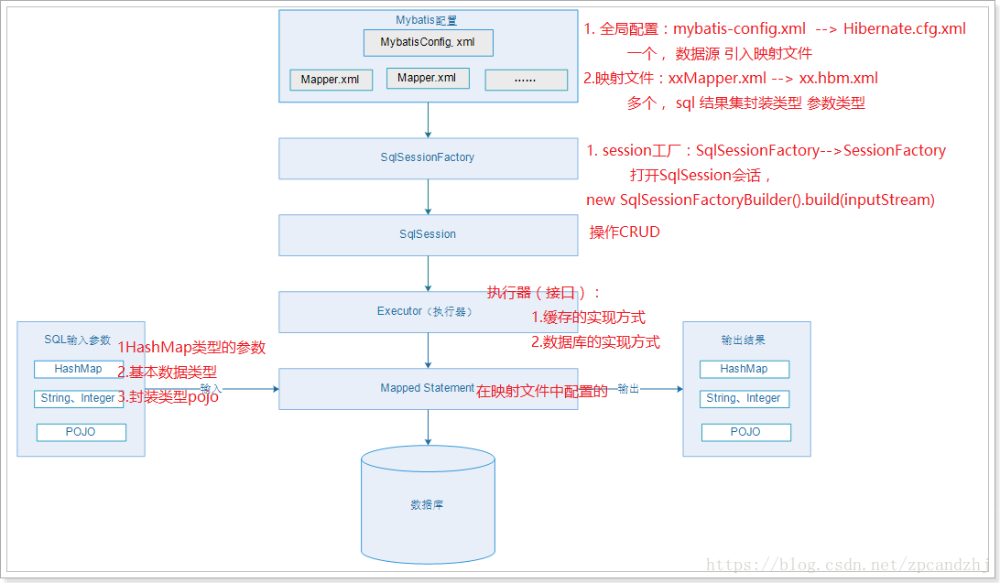

# 1 前言

参考文章：

Mybatis教程-实战看这一篇就够了    https://blog.csdn.net/hellozpc/article/details/80878563

只看上面的实战还远远不够，还需了解这个数据库中间件是如何与JDBC中定义的接口、数据库的驱动类/各种实现类 进行对接的？默认的连接池是啥，及其原理？


# 2 先从JDBC代码谈起
先回顾一下JDBC的用法：


```java
import java.sql.Connection;
import java.sql.DriverManager;
import java.sql.PreparedStatement;
import java.sql.ResultSet;

public class JDBCTest {
    public static void main(String[] args) throws Exception {
        Connection connection = null;
        PreparedStatement prepareStatement = null;
        ResultSet rs = null;

        try {
            // 加载驱动
            Class.forName("com.mysql.jdbc.Driver");

            // 获取连接
            String url = "jdbc:mysql://127.0.0.1:3306/ssmdemo";
            String user = "root";
            String password = "123456";
            //现在比较提倡直接使用DataSource获取连接
            connection = DriverManager.getConnection(url, user, password);


            // 获取statement，preparedStatement
            // preparedStatement又叫JDBC存储过程，SQL会先预编译，
            // 同一个preparedStatement反复执行只要换参数即可
            String sql = "select * from tb_user where id=?";
            prepareStatement = connection.prepareStatement(sql);
            
            // 设置参数
            // 注意！！！索引从1开始！！！
            prepareStatement.setLong(1, 1l);
            
            // 执行查询
            rs = prepareStatement.executeQuery();
            
            // 处理结果集
            while (rs.next()) {
                System.out.println(rs.getString("userName"));
                System.out.println(rs.getString("name"));
                System.out.println(rs.getInt("age"));
                System.out.println(rs.getDate("birthday"));
            }
        } finally {
            // 关闭连接，释放资源
            if (rs != null) {
                rs.close();
            }
            if (prepareStatement != null) {
                prepareStatement.close();
            }
            if (connection != null) {
                connection.close();
            }
        }
    }
}
```

我个人比较喜欢写JDBC，因为所有的过程都掌握在自己的代码里，比较自信。但是JDBC，还是有几个硬性问题的，尤其是在商业、大量数据库交互的环境里:

1. 有人会说，sql的用户名、密码什么的直接写在代码里了，时硬编码……然而，不敢苟同，现在完全可以写在配置文件里，然后通过配置文件实例化得到DataSource实例，从而进一步获取各种连接（单次连接、池连接、分布式连接）和各种事务，因此，**JDBC同样可以做到从配置文件得到数据库连接**。

2. sql和Java代码耦合……同样不敢苟同，同样可以自定义一个XML，XML是个sql的语句合集，给每个语句起个名字，java里调用XML反序列化得到的实例即可。想sql和java代码分离，还是看个人，也是有办法的

3. 使用JDBC存储过程时，填充占位的？时，确实需要类型判断，根据不同的类型调用不同的set方法，同时下表也要自己记住，JDBC存储过程的类型不同，还需要调用不同的executeXXXX()方法……这点确实比较麻烦

4. 对于查询语句，对ResultSet的结果，按例的类型取值时，确实要看表结果，表结果一改，Java代码就要改了


为了改进以上问题，考虑使用mybatis！

# 3 MyBatis介绍
MyBatis 是一款优秀的持久层框架，它支持自定义 SQL、存储过程以及高级映射。MyBatis 免除了几乎所有的 JDBC 代码以及设置参数和获取结果集的工作。MyBatis 可以通过简单的 XML 或注解来配置和映射原始类型、接口和 Java POJO（Plain Old Java Objects，普通老式 Java 对象）为数据库中的记录。

官方文档    https://mybatis.org/mybatis-3/zh/index.html



从框架图可以看出，MyBatis作为持久层的中间件，很好的解决了JDBC中很多无法简单做到（自己想做到也是可以的，造点轮子）的事情。

先来看一下的MyBatis的入门实践，对MyBatis有个认知，高级的高级用法如事务控制什么的，再慢慢深入。

## 3.1 编写配置文件

连接池配置文件,要注意的写在XML文件里的注释

```xml
<?xml version="1.0" encoding="UTF-8" ?>

<!DOCTYPE configuration
        PUBLIC "-//mybatis.org//DTD Config 3.0//EN"
        "http://mybatis.org/dtd/mybatis-3-config.dtd">
<!--上面的http表明了当前xml文件的标签约束配置，已经包含进jar中了，因为引入了 org.mybatis jar 包。
可见，java的文件索引就是跟Linux一样的，以文件树的形式分布/索引！每个项目的根目录都是一个文件书的起始位置！-->


<!-- 根标签 -->
<configuration>

    <!--  能共用的值  -->
    <properties>
        <property name="driver" value="com.mysql.cj.jdbc.Driver"/>
        <property name="url"
                  value="jdbc:mysql://localhost:3306/?serverTimezone=GMT%2B8"/>
        <property name="username" value="root"/>
        <property name="password" value="123456"/>


    </properties>

    <!-- 环境，可以配置多个，default：指定采用哪个环境 -->
    <environments default="test">


        <!-- id：唯一标识 -->
        <environment id="test">
            <!-- 事务管理器，JDBC类型的事务管理器 -->
            <transactionManager type="JDBC"/>
            <!-- 数据源，池类型的数据源 一般情况下会有普通连接、池连接、分布式连接三种实现-->
            <dataSource type="POOLED">
                <property name="driver" value="com.mysql.cj.jdbc.Driver"/>
                <property name="url" value="jdbc:mysql://localhost:3306/?serverTimezone=GMT%2B8"/>
                <property name="username" value="root"/>
                <property name="password" value="123456"/>
            </dataSource>
        </environment>


        <environment id="development">
            <!-- 事务管理器，JDBC类型的事务管理器 -->
            <transactionManager type="JDBC"/>
            <!-- 数据源，池类型的数据源 -->
            <dataSource type="POOLED">
                <property name="driver" value="${driver}"/> <!-- 配置了properties，所以可以直接引用 -->
                <property name="url" value="${url}"/>
                <property name="username" value="${username}"/>
                <property name="password" value="${password}"/>
            </dataSource>
        </environment>
    </environments>


    <!--  配置进mapper文件，即映射文件  -->
    <mappers>

        <!--  以资源路径为根目录的相对路径  -->
        <mapper resource="mybatis/mybatis-mapper.xml"/>

    </mappers>

</configuration>
```

SQL语句的映射合集：

```xml
<?xml version="1.0" encoding="UTF-8" ?>
<!DOCTYPE mapper
        PUBLIC "-//mybatis.org//DTD Mapper 3.0//EN"
        "http://mybatis.org/dtd/mybatis-3-mapper.dtd">

<!-- mapper:根标签，namespace：命名空间，随便写，一般保证命名空间唯一 -->
<mapper namespace="MyMapper">
    <!-- statement，内容：sql语句。id：唯一标识，随便写，在同一个命名空间下保持唯一
       resultType：sql语句查询结果集的封装类型,tb_user即为数据库中的表
     -->
    <select id="selectAuthor" resultType="java.lang.String">
        select author from test.table1 where id = #{id}
    </select>


</mapper>
```


注意：

1. 配置文件里的路径都是相对路径，相对的根路径是classPath，即为jar包的根目录

## 3.2 Java代码简单使用

Main.java

```java
package default_package.mybatis练习;

import org.apache.ibatis.session.SqlSession;
import org.apache.ibatis.session.SqlSessionFactory;
import org.apache.ibatis.session.SqlSessionFactoryBuilder;

import java.io.BufferedInputStream;
import java.io.IOException;
import java.io.InputStream;
import java.nio.charset.StandardCharsets;

public class Main {
    public static void main(String[] args) throws IOException {

        /*
        第一步，读取配置文件
         */
        String myBatisConfig = "mybatis/mybatis-config.xml";

        //正如注解所说，从类加载的地方寻找资源
        InputStream myBatisStream = ClassLoader.getSystemResourceAsStream(myBatisConfig);

        //也可以直接使用mybatis里提供的类读取文件
        // Resources.getResourceAsStream(myBatisConfig);

        //标记一下，为重复读取做一个书签
        ((BufferedInputStream) myBatisStream).mark(0);
        System.out.println("配置文件是：\n" + new String(myBatisStream.readAllBytes(),
                StandardCharsets.UTF_8));
        //读取游标重新设置到书签处，以供后续的重复读取
        ((BufferedInputStream) myBatisStream).reset();


        /*
        第二步，根据配置文件，按建造者模式，产生工厂实例
         */

        SqlSessionFactory sqlSessionFactory = new SqlSessionFactoryBuilder().build(myBatisStream);


        /*
        第三步，执行mapper中的语句
         */
         // openSession方法与很多重载，有的可以用来打开的事务session
        SqlSession sqlSession = sqlSessionFactory.openSession();
        
        //以map里的命名空间和sql的ID进行调用
        System.out.println((String) sqlSession.selectOne("MyMapper.selectAuthor", 4));

        //操作完要对sqlSession进行close()

        //如果使用了非自动提交的session（也就是事务session），需要手动控制提交、回滚


    }
}

```

##　3.3 步骤小结

1. 配置mybatis-config.xml 全局的配置文件 (1、数据源，2、外部的mapper)

2. 创建SqlSessionFactory

3. 通过SqlSessionFactory创建SqlSession对象

4. 通过SqlSession操作数据库 CRUD

5. 调用session.commit()提交事务

6. 调用session.close()关闭会话


# 4 完整CRUD操作
先构建数据库，执行一些DDL  SQL操作，为之后的DML做一下准备：

```sql
drop table if exists test.tb_user;

create table if not exists test.tb_user
(
    id        char(32) not null,
    user_name varchar(32) default null,
    password  varchar(32) default null,
    name      varchar(32) default null,
    age       int(10)     DEFAULT NULL,
    sex       int(2)      DEFAULT NULL,
    birthday  date        DEFAULT NULL,
    created   datetime    DEFAULT NULL,
    updated   datetime    DEFAULT NULL,
    primary key (id)

) engine = innodb
  default charset = utf8;

show tables from test;

select *
from test.tb_user;

insert into test.tb_user (id, user_name, password, name, age, sex, birthday, created, updated)
values ('zpc', 'zpc', '123456', '鹏程', '22', '1', '1990-09-02', sysdate(), sysdate());

insert into test.tb_user (id, user_name, password, name, age, sex, birthday, created, updated)
values ('hj', 'hj', '123456', '静静', '22', '1', '1993-09-05', sysdate(), sysdate());
```

接下来，以向数据库中更新用户信息为例，展现完整CRUD流程。

DAO：data access object

## 4.0 User  Bean

```java
import java.text.SimpleDateFormat;
import java.util.Date;

public class User {
    private String id;
    private String userName;
    private String password;
    private String name;
    private Integer age;
    private Integer sex;
    private Date birthday;
    private String created;
    private String updated;

    public String getId() {
        return id;
    }

    public void setId(String id) {
        this.id = id;
    }

    public String getUserName() {
        return userName;
    }

    public void setUserName(String userName) {
        this.userName = userName;
    }

    public String getPassword() {
        return password;
    }

    public void setPassword(String password) {
        this.password = password;
    }

    public String getName() {
        return name;
    }

    public void setName(String name) {
        this.name = name;
    }

    public Integer getAge() {
        return age;
    }

    public void setAge(Integer age) {
        this.age = age;
    }

    public Integer getSex() {
        return sex;
    }

    public void setSex(Integer sex) {
        this.sex = sex;
    }

    public Date getBirthday() {
        return birthday;
    }

    public void setBirthday(Date birthday) {
        this.birthday = birthday;
    }

    public String getCreated() {
        return created;
    }

    public void setCreated(String created) {
        this.created = created;
    }

    public String getUpdated() {
        return updated;
    }

    public void setUpdated(String updated) {
        this.updated = updated;
    }

    @Override
    public String toString() {
        return "User{" +
                "id='" + id + '\'' +
                ", userName='" + userName + '\'' +
                ", password='" + password + '\'' +
                ", name='" + name + '\'' +
                ", age=" + age +
                ", sex=" + sex +
                ", birthday='" + new SimpleDateFormat("yyyy-MM-dd").format(birthday) + '\'' +
                ", created='" + created + '\'' +
                ", updated='" + updated + '\'' +
                '}';
    }
}
```


## 4.1 创建UserDAO接口

```java
import com.zpc.mybatis.pojo.User;
import java.util.List;

public interface UserDao {

    /**
     * 根据id查询用户信息
     *
     * @param id
     * @return
     */
    public User queryUserById(String id);

    /**
     * 查询所有用户信息
     *
     * @return
     */
    public List<User> queryUserAll();

    /**
     * 新增用户
     *
     * @param user
     */
    public void insertUser(User user);

    /**
     * 更新用户信息
     *
     * @param user
     */
    public void updateUser(User user);

    /**
     * 根据id删除用户信息
     *
     * @param id
     */
    public void deleteUser(String id);
}
```

## 4.2 创建UserDaoImpl
创建接口的实现类

```java
import com.zpc.mybatis.dao.UserDao;
import com.zpc.mybatis.pojo.User;
import org.apache.ibatis.session.SqlSession;
import java.util.List;

public class UserDaoImpl implements UserDao {
    public SqlSession sqlSession;

    public UserDaoImpl(SqlSession sqlSession) {
        this.sqlSession = sqlSession;
    }

    @Override
    public User queryUserById(String id) {
        //selectOne  返回一个结果
        return this.sqlSession.selectOne("UserDao.queryUserById", id);
    }

    @Override
    public List<User> queryUserAll() {
        //selectList  查询一个列表
        return this.sqlSession.selectList("UserDao.queryUserAll");
    }

    @Override
    public void insertUser(User user) {
        //insert  插入一个对象
        this.sqlSession.insert("UserDao.insertUser", user);
    }

    @Override
    public void updateUser(User user) {
        //update  更新一个对象
        this.sqlSession.update("UserDao.updateUser", user);
    }

    @Override
    public void deleteUser(String id) {
        //delete  删除一个对象
        this.sqlSession.delete("UserDao.deleteUser", id);
    }

}
```
## 4.3 编写对应的mapper

mapper里定义的的命名空间和sql ID，要和UserDaoImpl里所使用的对应起来

```XML
<?xml version="1.0" encoding="UTF-8" ?>
<!DOCTYPE mapper
        PUBLIC "-//mybatis.org//DTD Mapper 3.0//EN"
        "http://mybatis.org/dtd/mybatis-3-mapper.dtd">

<!-- mapper:根标签，namespace：命名空间 -->
<mapper namespace="UserDao">
    <!-- statement，内容：sql语句。id：唯一标识，随便写，在同一个命名空间下保持唯一
       resultType：sql语句查询结果集的封装类型,tb_user即为数据库中的表
     -->
    <!--<select id="queryUserById" resultType="com.zpc.mybatis.pojo.User">-->
    <!--select * from tb_user where id = #{id}-->
    <!--</select>-->

    <!--使用别名，务必跟Bean里的属性名一摸一样！！！！！才能反序列化为一个User实例-->
    <select id="queryUserById" resultType="com.zpc.mybatis.pojo.User">
      select
       tuser.id as id,
       tuser.user_name as userName,
       tuser.password as password,
       tuser.name as name,
       tuser.age as age,
       tuser.birthday as birthday,
       tuser.sex as sex,
       tuser.created as created,
       tuser.updated as updated
       from
       tb_user tuser
       where tuser.id = #{id};
   </select>

    <select id="queryUserAll" resultType="com.zpc.mybatis.pojo.User">
        select * from tb_user;
    </select>

    <!--插入数据，占位的属性务必和Bean里的属性名相同-->
    <insert id="insertUser" parameterType="com.zpc.mybatis.pojo.User">
        INSERT INTO tb_user (
        user_name,
        password,
        name,
        age,
        sex,
        birthday,
        created,
        updated
        )
        VALUES
        (
        #{userName},
        #{password},
        #{name},
        #{age},
        #{sex},
        #{birthday},
        now(),
        now()
        );
    </insert>

    <!-- 其实就是  update  tb_user set user_name = #{userName},xxxx
    where id = #{id}；
    
    只不过再用了mybatis里的一些修时语法，if标签，预置 set sql关键字-->
    <update id="updateUser" parameterType="com.zpc.mybatis.pojo.User">
        UPDATE tb_user
        <trim prefix="set" suffixOverrides=",">
            <if test="userName!=null">user_name = #{userName},</if>
            <if test="password!=null">password = #{password},</if>
            <if test="name!=null">name = #{name},</if>
            <if test="age!=null">age = #{age},</if>
            <if test="sex!=null">sex = #{sex},</if>
            <if test="birthday!=null">birthday = #{birthday},</if>
            updated = now(),
        </trim>
        WHERE
        (id = #{id});
    </update>

    <delete id="deleteUser">
        delete from tb_user where id=#{id}
    </delete>
</mapper>
```


mapper的xml定义完，还要将mapper放进全局配置文件中。

```xml
<mappers>
    <mapper resource="mappers/MyMapper.xml"/>
    <mapper resource="mappers/UserDaoMapper.xml"/>
</mappers>
```
## 4.4 用Junit创建UT

```java
import com.zpc.mybatis.dao.UserDao;
import com.zpc.mybatis.dao.impl.UserDaoImpl;
import com.zpc.mybatis.pojo.User;
import org.apache.ibatis.io.Resources;
import org.apache.ibatis.session.SqlSession;
import org.apache.ibatis.session.SqlSessionFactory;
import org.apache.ibatis.session.SqlSessionFactoryBuilder;
import org.junit.Before;
import org.junit.Test;
import java.io.InputStream;
import java.util.Date;
import java.util.List;

public class UserDaoTest {

    public UserDao userDao;
    public SqlSession sqlSession;

    @Before
    public void setUp() throws Exception {
        // mybatis-config.xml
        String resource = "mybatis-config.xml";
        // 读取配置文件
        InputStream is = Resources.getResourceAsStream(resource);
        // 构建SqlSessionFactory
        SqlSessionFactory sqlSessionFactory = new SqlSessionFactoryBuilder().build(is);
        // 获取sqlSession
        sqlSession = sqlSessionFactory.openSession();
        this.userDao = new UserDaoImpl(sqlSession);
    }

    @Test
    public void queryUserById() throws Exception {
        System.out.println(this.userDao.queryUserById("1"));
    }

    @Test
    public void queryUserAll() throws Exception {
        List<User> userList = this.userDao.queryUserAll();
        for (User user : userList) {
            System.out.println(user);
        }
    }

    @Test
    public void insertUser() throws Exception {
        User user = new User();
        user.setAge(16);
        user.setBirthday(new Date("1990/09/02"));
        user.setName("大鹏");
        user.setPassword("123456");
        user.setSex(1);
        user.setUserName("evan");
        this.userDao.insertUser(user);
        this.sqlSession.commit();
    }

    @Test
    public void updateUser() throws Exception {
        User user = new User();
        user.setBirthday(new Date());
        user.setName("静鹏");
        user.setPassword("654321");
        user.setSex(1);
        user.setUserName("evanjin");
        user.setId("1");
        this.userDao.updateUser(user);
        this.sqlSession.commit();
    }

    @Test
    public void deleteUser() throws Exception {
        this.userDao.deleteUser("4");
        this.sqlSession.commit();
    }

}

```

原作者的UT里面，每个DML操作的最后，都使用了this.sqlSession.commit();来进行提交，因为：

```java
  public SqlSession openSession() {
    return openSessionFromDataSource(configuration.getDefaultExecutorType(), null, false);
  }
```
通过openSession得到SqlSession时，最后一个参数时false，即为 不自动提交，和JDBC里不同，JDBC里直接得到的connection是自动提交的。**在JDBC中**，要进行事务操作时，必须先设置connection的autoCommit 属性为false。

## 4.5 注意事项、坑点、总结
其实就是输入、输出的坑点。

输入的坑点是：

实体作为mapper的入参，有可能是一个或者多个实体类，实体类如何与传入的参数一一对应？

结果输出的坑点是：

查出来的结果，一般是的是要映射成特殊的类 或者 Map，字段名和类的属性名如何对应起来？

### 4.5.1 mapper多个参数
一般情况下，直接定义DAO接口类，然后在mapper中绑定：

```java
// 只有一个入参的DAO
int insert(AtMe record);
```

在mapper.xml绑定：

```xml
<insert id="insert" keyColumn="id" keyProperty="id" parameterType="com.jeasonchan.AtMe" useGeneratedKeys="true">
insert into at_me 

(req_no, comment_id, from_by,from_name, to_by, to_name)

values 

( #{reqNo,jdbcType=VARCHAR}, #{commentId,jdbcType=VARCHAR}, #{fromBy,jdbcType=VARCHAR}, 
    #{fromName,jdbcType=VARCHAR}, #{toBy,jdbcType=VARCHAR}, #{toName,jdbcType=VARCHAR} );
</insert>
```
只有一个入参，通过#{xxxxx}直接读取Atme实例中的属性，应该是根据反射+属性名获取的


### 4.5.2 查询结果映射为Map/实体


### 4.5.3 mybatis的高度拼装、自由、灵活体现
查询条件、结果集都可以拆分定义，sql本身都能根据传入的参数动态生成。


### 4.5.4 整合/调用方式

#### 4.5.4.1 DAO实现类通过sqlsession


#### 4.5.4.2 mappper直接绑定DAO接口类，无需实现

**这也是的官方推荐的方法。**


