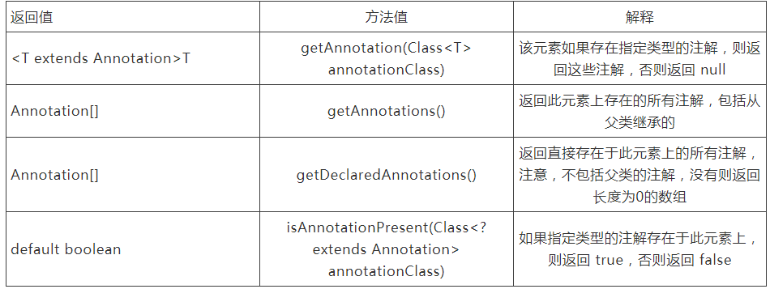

# 1 背景
实践一下注解。

参考文章：
[java自定义注解和使用](https://cloud.tencent.com/developer/article/1485708)

# 2 代码实践
如何在运行时获取注解的值？java在java.lang.reflect包中定义了AnnotatedElement接口，Class，Method，Field等都实现了该接口，通过该接口提供的方法，就可以获得我们需要的信息，并且该接口的方法返回的数组可以由调用方修改，而不影响返回到其他调用方的数组。

AnnotatedElement接口的一部分方法：

java.lang.Class中的getDeclared**表示获取自己的东西，而get**方法表示获取自己的和父类的东西，这个接口沿用了这种命名方式。

注解定义：
```java
@Target(ElementType.FIELD)
@Retention(RetentionPolicy.RUNTIME)
public @interface FruitName {

    // 当不指定默认值时，则必须在写注解的时候写上这个属性的值
    String value() default "";
    String alias() default "";
}
```
```java
public enum Color {
    BLUE, RED, GREEN
}
```
```java
@Target(ElementType.FIELD)
@Retention(RetentionPolicy.RUNTIME)
public @interface FruitColor {

    Color fruitColor() default Color.GREEN;
}
```

实际使用：
```java
public class Apple {

    // 当只想给value赋值时，可以使用如下快捷方式
    // @FruitName("apple")
    // 当多个属性赋值时，必须采用key=value的形式
    @FruitName(value = "apple", alias = "iphone")
    private String name;

    @FruitColor(fruitColor = Color.RED)
    private String color;

    public static void main(String[] args) {

        Field[] fields = Apple.class.getDeclaredFields();
        for (Field field : fields) {
            if (field.isAnnotationPresent(FruitName.class)) {
                FruitName fruitName = (FruitName) field.getAnnotation(FruitName.class);
                // fruitName is apple
                System.out.println("fruitName is " + fruitName.value());
                // alias is iphone
                System.out.println("alias is " + fruitName.alias());
            } else if (field.isAnnotationPresent(FruitColor.class)) {
                FruitColor fruitColor = (FruitColor) field.getAnnotation(FruitColor.class);
                // fruitColor is RED
                System.out.println("fruitColor is " + fruitColor.fruitColor().name());
            }
        }
    }
}
```
# 3 自定义注解和spring的结合实践
参见参考文章原文，主要是使用了注解和AOP的结合。