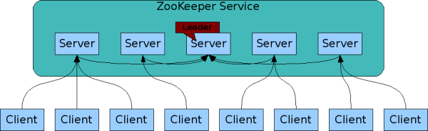
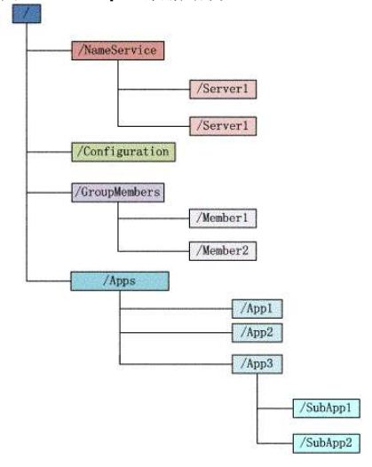
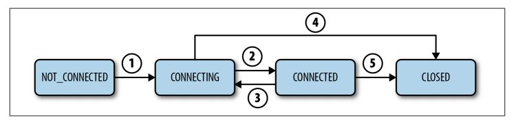

# 1 前言
参考文章：

（科普向）ZooKeeper是如何保证数据一致性的    https://blog.csdn.net/qq_41936805/article/details/98069515


（原理向）ZooKeeper基本原理   https://www.cnblogs.com/luxiaoxun/p/4887452.html


安装和配置   https://www.jianshu.com/p/de90172ea680


（zookeeper代码实现分析）  https://blog.csdn.net/qq_32717909/article/details/94836873     


（java  api 介绍）  https://www.jianshu.com/p/44843a3af9ba


(zookeeper原生api高级封装 Curator介绍)   https://www.cnblogs.com/qingyunzong/p/8666288.html


目前，分布式系统都是采用一主多从的方式进行部署，在分布式系统的多台服务器要对数据状态达成一致，其实是一件很有难度的事情，因为服务器集群的硬件的问题随时会发生，所以对数据的记录保持一致，是需要一定技巧的。

比如说，我们有两个应用程序都需要对一个相同的文件路径/相同的字段进行读写，但是，如果这两个应用程序对于哪台是namenode的判断不同，就会连接到不同的namenode上，两份文件/数据同时做了不同的修改，同一个数据产生了不同的分支，出现数据冲突，最终，同一个文件名/数据名 指向了两份不同的数据。

**为了保证多台服务器之间数据/文件的一致性**，就有了Zookeeper。

ZooKeeper是一个开放源码的分布式应用程序协调服务，它包含一个简单的原语集，**分布式应用程序可以基于它实现同步服务，配置维护和命名服务等。**


zookeeper也是采用的一主多从的方式进行部署，但是！每个zookeeper节点在都是等价的，增删改查等操作会平等的发给每个节点，不像mysql的主从模式（可能有多种，但是本人目前只了知道一种）。MySQL的主从模式，主库负责DML，从库负责DQL，然后通过binlog实现主从的数据同步。MySQL的主从分别相应客户端不同的动作，而通zookeeper的主从节点都相应客户端的所有操作。

zookeeper的运行结构图如下：



# 2 设计目的（特性）
1. 最终一致性:

client不论连接到哪个server，展示给client的都是同一个视图，这是zookeeper最重要的的特性

2. 可靠性：

具有的简单、健壮、良好的性能，如果client发出的请求被一台服务器接收到，那么它将被所有的服务器接收到

3. 实时性：

zookeeper能保证client能获取最近的一段时间范围内的最新的数据 或则 服务器直接不可用的消息（所以，client查询数据时，要么能获取到可接受的范围内的最新数据，要么是服务器炸了直接获取不到消息）。但是，由于网络延迟等因素，不同client的watcher收到同一数据变化的消息可能会有时差。**如果client就想最新的数据，应该在查询前先调用sync()接口。**

4. 等待无关：

慢的或者失效的client（其实 client的session）不能干预快速的client的请求，这样使得每个client的session都能有效等待。

5. 顺序性：

包括全局有序和偏序两种：全局有序是指如果在一台服务器上消息a在消息b前发布，则在所有Server上消息a都将在消息b前被发布；偏序是指如果一个消息b在消息a后被同一个client发布，a必将排在b前面。

6. 原子性：

数据更新只能成功或者失败，没有中间状态

# 3 zookeeper数据模型
Zookeeper会维护一个具有层次关系的数据结构，它非常类似于一个标准的文件系统，如图所示：



Zookeeper这种树形的数据结构有如下这些特点：

1）每个子目录项,比如,图中的NameService都被称作为znode，这个znode是被它所在的路径唯一标识，再比如,其子节点  Server1这个znode的标识为/NameService/Server1。

2）znode可以有子节点目录，并且每个znode可以存储数据，注意EPHEMERAL（临时的）类型的目录节点不能有子节点目录。

3）znode是有版本的（version），每个znode中存储的数据可以有多个版本，也就是**一个访问路径中可以存储多份数据，version号自动增加**。

4）znode的类型：

* Persistent 节点，即持久节点,一旦被创建，便不会意外丢失，即使服务器全部重启也依然存在。每个 Persistent 节点即可包含数据，也可包含子节点。

* Ephemeral 节点，即临时节点,在创建它的客户端与服务器间的 Session 结束时自动被删除。服务器重启会导致 Session 结束，因此 Ephemeral 类型的 znode 此时也会自动删除。

* Non-sequence 节点，即非排序节点, 多个客户端同时创建同一 Non-sequence 节点时，只有一个可创建成功，其它匀失败。并且**创建出的节点名称与创建时指定的节点名完全一样。**

* Sequence 节点，即自动增序节点, 创建出的节点名由两部分组成:原先指定的名称 + 自动生成的10位10进制数的序号。多个客户端创建同一名称的节点时，都能创建成功，只是序号不同。

5）znode可以被监控，包括:这个目录节点中存储的数据的修改、子节点目录的变化等，一旦变化可以通知设置监控的客户端，**这个是Zookeeper的核心特性，Zookeeper的很多功能都是基于这个特性实现的**。

6）ZXID：每次对Zookeeper的状态的改变都会产生一个zxid（ZooKeeper Transaction Id），zxid是全局有序的，如果zxid1小于zxid2，则zxid1在zxid2之前发生。ZXID和MySQL中的mvcc的事务ID相似，都能用来表示数据的新旧，事务ID越大，表明数据越新

# 4 ZooKeeper Session
**Client和Zookeeper集群建立连接，从Java代码的new Zookeeper的构造参数的connectString就可以看出，是个整个集群建立连接**，从**服务端的角度来看**整个client的session状态变化如图所示：



如果Client因为Timeout和Zookeeper Server失去连接，client处在CONNECTING状态，会自动尝试再去连接Server，如果在session有效期内再次成功连接到某个Server，则回到CONNECTED状态。

注意：如果因为网络状态不好，client和Server失去联系，client会停留在当前状态，会尝试主动再次连接Zookeeper Server。**client不能宣称自己的session expired（session过期）**，session expired是由Zookeeper Server来决定的，client可以选择自己主动关闭session。

# 5 ZooKeeper Watch
Zookeeper watch是一种监听通知机制。Zookeeper可以对所有的读操作getData(), getChildren()和 exists()附加监视(watch)，即得到的内容发生了变化，就会触发执行watch里的回调函数。回调函数的入参是一个WatchEvent（监听事件）对象，监视事件可以理解为**一次性**的触发器，官方定义如下： a watch event is one-time trigger, sent to the client that set the watch, whichoccurs when the data for which the watch was set changes。Watch的三个关键点：

*（一次性触发）One-time trigger

当设置监视的数据发生改变时，该监视事件会被发送到客户端，例如，如果客户端调用了getData("/znode1", true) 并且稍后 /znode1 节点上的数据发生了改变或者被删除了，客户端将会获取到 /znode1 发生变化的监视事件，而如果 /znode1 再一次发生了变化，除非客户端在 /znode1 发生变化前再次对/znode1 设置监视，否则客户端不会收到事件通知。

*（发送至客户端）Sent to the client

Zookeeper客户端和服务端是通过 socket 进行通信的，由于网络存在故障，所以监视事件很有可能不会一次就成功地到达客户端，监视事件是异步发送至监视者的，Zookeeper 本身提供了顺序保证(ordering guarantee)：即**客户端只有首先收到了监视事件，get操作才能get出来和之前不一样的东西给，也就是watchEvent发送给客户端失败会屏蔽client获取到最新的节点数据**(a client will never see a change for which it has set a watch until it first sees the watch event)。网络延迟或者其他因素可能导致不同的客户端在不同的时刻感知某一监视事件，但是不同的客户端所看到的一切具有一致的顺序。

*（被设置 watch 的数据）The data for which the watch was set

这意味着znode节点本身具有不同的改变方式。你也可以想象 Zookeeper 维护了两条监视链表：数据监视和子节点监视(data watches and child watches)。 

getData()查询znode存的二进制、exists()查询znode节点是否存在，这两个get方法相当于设置数据监视。

getChildren()查询字节的列表，设置子节点监视。

因此，setData() 会触发设置在某一节点上所设置的数据监视（假定数据设置成功），而一次成功的znode的create() 操作则会出发当前节点上所设置的数据监视（getExist()方法）以及父节点的子节点监视（getChildren()）。一次成功的znode delete操作将会触发当前节点的数据监视（getExist()方法）和子节点监视事件，同时也会触发该节点父节点的child watch。

Zookeeper 中的监视是轻量级的，因此容易设置、维护和分发。当客户端与 Zookeeper 服务器失去联系时，客户端并不会收到监视事件的通知，只有当客户端重新连接后，若在必要的情况下，以前注册过的监视，但是未被客户端成功接收的watchEvent会被重新尝试发送（client收到这个之后，才可以get最新的节点数据，跟前文描述的一致：客户端只有首先收到了监视事件，get操作才能get出来和之前不一样的东西给，也就是watchEvent发送给客户端失败会屏蔽client获取到最新的节点数据），对于开发人员来说这通常是透明的。只有一种情况会导致监视事件的丢失，即：通过exists()设置了某个znode节点的监视，但是如果某个客户端在此znode节点被创建和删除的时间间隔内与zookeeper服务器失去了联系，该客户端即使稍后重新连接 zookeeper服务器后也得不到事件通知。


# 6 Consistency Guarantees(一致性保证)
Zookeeper是一个高效的、可扩展的服务，read和write操作都被设计为快速的，read比write操作更快。

顺序一致性（Sequential Consistency）：从一个客户端来的更新请求会被顺序执行。

原子性（Atomicity）：更新要么成功要么失败，没有部分成功的情况。

唯一的系统镜像（Single System Image）：无论客户端连接到哪个Server，看到系统镜像是一致的。

可靠性（Reliability）：更新一旦有效，持续有效，直到被覆盖。

时间线（Timeliness）：保证在一定的时间内各个客户端看到的系统信息是一致的。

# 7 ZooKeeper的工作原理
在zookeeper的集群中，各个节点共有下面3种角色和4种状态：

* 角色：leader,follower,observer
* 状态：leading,following,observing,looking

Zookeeper的核心是原子广播，这个机制保证了各个Server之间的同步。实现这个机制的协议叫做Zab协议（ZooKeeper Atomic Broadcast protocol）。协议介绍见下文。

Zab协议有两种模式，它们分别是恢复模式（Recovery选举）和广播模式（Broadcast同步）。当服务启动或者在领导者崩溃后，Zab就进入了恢复模式，当领导者被选举出来，且大多数Server完成了和leader的状态同步以后，恢复模式就结束了。状态同步保证了leader和Server具有相同的系统状态。

为了保证事务的顺序一致性，zookeeper采用了递增的事务id号（zxid）来标识事务。所有的提议（proposal）都在被提出的时候加上了zxid。**实现中zxid是一个64位的数字，它高32位是epoch用来标识leader关系是否改变，每次一个leader被选出来，它都会有一个新的epoch，标识当前属于那个leader的统治时期。低32位用于递增计数。**

每个Server在工作过程中有4种状态：

LOOKING：当前Server不知道leader是谁，正在搜寻。

LEADING：当前Server即为选举出来的leader。

FOLLOWING：leader已经选举出来，当前Server与之同步。

OBSERVING：observer的行为在大多数情况下与follower完全一致，但是他们不参加选举和投票，而仅仅接受(observing)选举和投票的结果。

## 7.1 Leader Election 选举流程（paxos算法）
当leader崩溃或者leader失去大多数的follower，这时候zk进入恢复模式，恢复模式需要重新选举出一个新的leader，让所有的Server都恢复到一个正确的状态。Zk的选举算法有两种：一种是基于basic paxos实现的，另外一种是基于fast paxos算法实现的。系统默认的选举算法为fast paxos。先介绍basic paxos流程：

1. 选举线程由当前Server发起选举的线程担任，其主要功能是对投票结果进行统计，并选出推荐的Server；

2. 选举线程首先向所有Server发起一次询问（包括自己）；

3. 选举线程收到各个server的回复后，验证是否是自己发起的询问（选举回复中包含事务ID zxid，验证zxid是否一致即可），然后解析到对方的id（myid），并存储到当前询问对象列表中，最后解析得到对方提议的leader相关信息（id,zxid），并将这些信息存储到当次选举的投票记录表中；

4. 选举线程收到所有Server回复以后，就遍历统计表，计算出被提议的server中，zxid最大（zxid最大，说明数据越新）的那个Server；

5. 线程将当前zxid最大的Server设置为当前Server**要推荐的Leader**，如果此时获胜的Server获得n/2 + 1的Server票数，设置当前推荐的leader为**获胜的Server（最终leader）**，剩下处于looking状态的server将根据获胜的Server相关信息设置自己的状态，否则，继续这个过程，直到leader被选举出来。

通过流程分析我们可以得出：要使Leader获得多数Server的支持，则Server总数必须是奇数2n+1，且存活的Server的数目不得少于n+1.

每个Server启动后都会重复以上流程。在恢复模式下，如果是刚从崩溃状态恢复的或者刚启动的server还会从磁盘快照中恢复数据和会话信息，zk会记录事务日志并定期进行快照，方便在恢复时进行状态恢复。

fast paxos流程是在选举过程中，某Server首先向所有Server提议自己要成为leader，当其它Server收到提议以后，解决epoch和zxid的冲突，并接受对方的提议，然后向对方发送接受提议完成的消息，重复这个流程，最后一定能选举出Leader。


## 7.2 Leader工作流程
Leader主要有三个功能：

1. 恢复数据；

2. 维持与follower的心跳，接收follower请求并判断follower的请求消息类型；

3. 相应follower的消息，类型主要有PING消息、REQUEST消息、ACK消息、REVALIDATE消息，并根据不同的消息类型，进行不同的处理。

PING消息是指follower的心跳信息；REQUEST消息是follower发送的提议信息，包括写请求及同步请求；

ACK消息是follower的对提议的回复，超过半数的follower通过，则commit该提议；

REVALIDATE消息是用来延长SESSION有效时间。

## 7.3 Follower工作流程
Follower主要有四个功能：

1. 向Leader发送请求（PING消息、REQUEST消息、ACK消息、REVALIDATE消息）；

2. 接收Leader消息并进行处理；

3. **接收Client的请求**，如果为写请求，发送给Leader进行投票（与MySQL的集群类似，主库为DML，从库为DQL）；

4. 返回Client结果。

以上四个功能在消息循环中进行处理，Follower的**消息循环**处理如下几种具体的来自Leader的消息：

1. PING消息：心跳消息

2. PROPOSAL消息：Leader发起的提案，要求Follower投票

3. COMMIT消息：服务器端最新一次提案的信息

4. UPTODATE消息：表明同步完成

5. REVALIDATE消息：根据Leader的REVALIDATE结果，关闭待revalidate的session还是允许其接受消息

6. SYNC消息：返回SYNC结果到客户端，这个消息最初由客户端发起，用来强制得到最新的更新。

## 7.4 Zab: Broadcasting State Updates
Zookeeper Server集群接收到一次request，如果是follower，会转发给leader，Leader执行请求并通过Transaction的形式广播这次执行。Zookeeper集群如何决定一个Transaction是否被commit执行？通过“两阶段提交协议”（a two-phase commit）：

1. Leader给所有的follower发送一个PROPOSAL消息。一个follower接收到这次PROPOSAL消息，写到磁盘，发送给leader一个ACK消息，告知已经收到。

2. 当Leader收到法定人数（quorum）的follower的ACK时候，发送commit消息执行。

Zab协议保证：

1. 如果leader以T1和T2的顺序广播，那么所有的Server必须先执行T1，再执行T2。

2. 如果任意一个Server以T1、T2的顺序commit执行，其他所有的Server也必须以T1、T2的顺序执行。

“两段提交协议”可能存在的最大的问题是，如果Leader发送了PROPOSAL消息后crash或暂时失去连接，会导致整个集群处在一种不确定的状态（follower不知道该放弃这次提交还是执行提交）。这时候，Leader选举可以解决这种情况，Zookeeper这时会选出新的leader，请求处理也会移到新的leader上，不同的leader由不同的epoch标识。切换Leader时，需要解决下面两个问题：

1. Never forget delivered messages

老Leader在COMMIT投递到任何一台follower之前crash，结果只有它自己commit了。经过选举后，新Leader必须保证这个事务也必须commit。新leader再发起一轮投票？？？？

2. Let go of messages that are skipped

旧Leader产生了某个proposal，还没有follower看到这个proposal，自己就挂了。该server恢复时，必须丢弃这个proposal。

Zookeeper会**尽量保证**不会同时有2个活动的Leader，因为2个不同的Leader会导致集群处在一种不一致的状态，所以Zab协议同时保证：

1. 在新的leader广播Transaction之前，老Leader commit的Transaction都会先执行。

2. 在任意时刻，都不会有2个Server同时有法定人数（quorum）的支持者。

这里的quorum是一半以（n/2+1）上的Server数目，确切的说是有投票权力的Server（不包括Observer）。

Zab的具体实现，保证了以上要点之后，就能的保证了集群在新/旧Leader的指挥下，保证最终强一致性结果。

# 12 安装和配置
## 12.1 下载、解压
从zookeeper官方下载包，并解压到合适的目录。

官网有两个包，一个是源码包，一个是编译之后的包，选择编译之后的包进行下载。编译后的包，主程序都是一样的，只不过bin目录中包含适用于win和bash的程序启动脚本。

## 12.2 配置系统环境变量

```
# ZooKeeper Env
export ZOOKEEPER_HOME=/opt/zookeeper
export PATH=$PATH:$ZOOKEEPER_HOME/bin
```
为了能直接在终端启动zookeeper sever，需要配置以上的系统环境变量。如果自己不嫌麻烦，并且想实验单机集群的，就不用配环境变量，每次cd到bin目录下执行相应的启动、暂停脚本即可。

## 12.3 编写核心配置文件
初次使用 ZooKeeper 时, 需要将 $ZOOKEEPER_HOME/conf 目录下的 zoo_sample.cfg 重命名为 zoo.cfg, zoo.cfg 默认配置如下:

```bash
# The number of milliseconds of each tick
# tick是指该应用的基本计时单位，下文的时间设置都是
# 以tickTime乘以相应的数字得到最终的实际实际时间
# zookeeper的默认时是2000，即2000毫秒
tickTime=2000


# The number of ticks that the initial
# synchronization phase（同步） can take
# 默认值是 10, 即 tickTime 属性值的 10 倍。
# 它用于配置允许 followers 初始连接并同步到 leader 的最大时间。
# 如果 ZooKeeper 管理的数据量很大的话可以增加这个值。
initLimit=10


# The number of ticks that can pass between
# sending a request and getting an acknowledgement
# 默认值是 5, 即 tickTime 属性值的 5 倍。
# 它用于配置leader 和 followers 间进行心跳检测的最大延迟时间。
# 如果在设置的时间内 followers 无法与 leader 进行通信, 那么 followers 将会被丢弃。
syncLimit=5


# the directory where the snapshot is stored.
# do not use /tmp for storage, /tmp here is just
# example sakes.
# ZooKeeper 用来存储内存数据库快照的目录, 
# 并且除非指定其它目录, 否则数据库更新的事务日志也将会存储在该目录下。
# 建议单独配置 dataLogDir 参数来指定 ZooKeeper 事务日志的存储目录。
# 该路径必须使用绝对路径，不支持相对路径也不支持用户路径（~标志）
dataDir=/tmp/zookeeper


# the port at which the clients will connect
# 服务器监听客户端连接的端口, 也即客户端尝试连接的端口, 默认值是 2181。
clientPort=2181


# the maximum number of client connections.
# increase this if you need to handle more clients
# 在 socket 级别限制单个客户端与单台服务器之前的并发连接数量,
# 可以通过 IP 地址来区分不同的客户端。
# 它用来防止某种类型的 DoS 攻击, 包括文件描述符耗尽。
# 默认值是 60。将其设置为 0 将完全移除并发连接数的限制。
#maxClientCnxns=10


# Be sure to read the maintenance section of the
# administrator guide before turning on autopurge.
#
# http://zookeeper.apache.org/doc/current/zookeeperAdmin.html#sc_maintenance
#
# The number of snapshots to retain in dataDir
# 配置 ZooKeeper 在自动清理的时候需要保留的数据文件快照的数量和对应的事务日志文件, 默认值是 3。
#autopurge.snapRetainCount=3


# Purge task interval（间隙） in hours
# Set to "0" to disable auto purge feature
# 和参数 autopurge.snapRetainCount 配套使用, 
# 用于配置 ZooKeeper 自动清理文件的频率, 默认值是 1, 即1小时清理一次
# 即默认开启自动清理功能, 设置为 0 则表示禁用自动清理功能。
#autopurge.purgeInterval=1


## Metrics Providers
#
# https://prometheus.io Metrics Exporter
#metricsProvider.className=org.apache.zookeeper.metrics.prometheus.PrometheusMetricsProvider
#metricsProvider.httpPort=7000
#metricsProvider.exportJvmInfo=true
```

## 12.4 针对单机配置文件
zoo.cfg配置文件：

```bash
ticketTime=2000
clientPort=2181
dataDir=/opt/zookeeper/data
dataLogDir=/opt/zookeeper/logs
```

启动服务：

```bash
# cd 到apache的bin文件夹
cd /c/CRsoftwares/apache-zookeeper-3.6.1/master/bin
./zkServer.sh start

# 启动信息打印如下：
ZooKeeper JMX enabled by default
Using config: C:\CRsoftwares\apache-zookeeper-3.6.1\master\conf\zoo.cfg
Starting zookeeper ... STARTED
```

验证zookeeper服务：

```bash
cd /c/CRsoftwares/apache-zookeeper-3.6.1/master/bin
./zkCli.sh
ls  /

# 输出如下，一开始只有系统自动创建的zookeeper目录
[zookeeper]
```


## 12.5 针对集群配置文件


# 13 Java api 实践
zookeeper依赖：
```xml
<dependency>
    <groupId>org.apache.zookeeper</groupId>
    <artifactId>zookeeper</artifactId>
    <version>3.4.8</version>
</dependency>
```

导入以上依赖后就可以使用原生的api对zookeeper进行节点的增删改查和监听了，但是原生api实现分布式锁等高级功能，较为复杂，可以考虑使用第三方封装好的zookeeper客户端，比如：
* ZkClient，第三方个人开发
* Curator, Apache自身的开源项目,其中一个组件包含了几种典型场景的封装实现:
```xml
<dependency>
    <groupId>org.apache.curator</groupId>
    <artifactId>curator-recipes</artifactId>
    <version>4.1.0</version>
</dependency>
```
