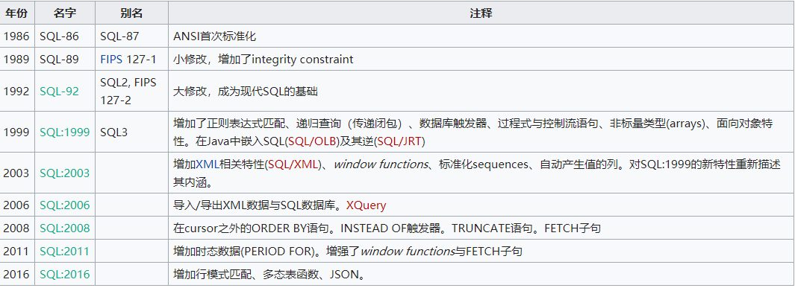

# 1 sql介绍
 SQL（Structured Query Language 结构化查询语句）是一种特定目的程序语言，用于管理关系数据库管理系统（RDBMS），或在关系流数据管理系统（RDSMS）中进行流处理。

 SQL基于关系代数和元组关系演算，包括一个数据定义语言和数据操纵语言。SQL的范围包括数据插入、查询、更新和删除，数据库模式创建和修改，以及数据访问控制。

 因为，SQL用的人太多了，虽然是设计出来针对关系型数据库的，但是现在的很多非关系型数据库也兼容了SQL语法，比如，对象存储型数据库postgresql，兼容了大部分的SQL语法。
 
 

# 2 sql语法概览
 sql语法部分主要参考菜鸟教程，<https://www.runoob.com/sql/sql-syntax.html>。
 要操作数据库之前的，首先要进入的自己的要操作的数据库实例，一个实例包含一个或者多个表，先来看一下典型的SQL语句例子：
 ```sql
use RUNOOB;
set names utf8;
SELECT * FROM Websites;
 ```
对以上的解析：
* use RUNOOB; 命令用于选择数据库。
* set names utf8; 命令用于设置使用的字符集。
* SELECT * FROM Websites; 读取表“Websites”的信息。
* SQL关键字对大小写不敏感：SELECT 与 select 是相同的，但是！SQL关键字建议大写，而表名和字段名务必当作是大小写敏感的……
* 分号是在数据库系统中分隔每条 SQL 语句的标准方法，这样就可以在对服务器的相同请求中执行一条以上的 SQL 语句。

**一些最重要的 SQL 命令，即为学习提纲**
* SELECT - 从数据库中提取数据
* UPDATE - 更新数据库中的数据
* DELETE - 从数据库中删除数据
* INSERT INTO - 向数据库中插入新数据
* CREATE DATABASE - 创建新数据库
* ALTER DATABASE - 修改数据库
* CREATE TABLE - 创建新表
* ALTER TABLE - 变更（改变）数据库表
* DROP TABLE - 删除表
* CREATE INDEX - 创建索引（搜索键）
* DROP INDEX - 删除索引
