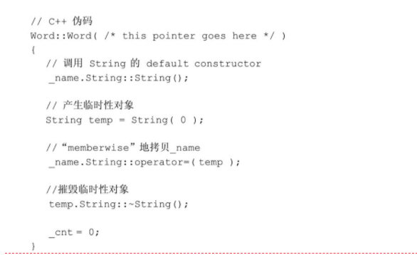

# 0 背景
读书的过程中，除了阅读原始书籍之外，同时还参考了部分老哥的笔记。


参考文章：

xiezhw3/Inside-the-C-plus-plus-Object-Model-note   https://github.com/xiezhw3/Inside-the-C-plus-plus-Object-Model-note/tree/master/%E7%AC%94%E8%AE%B0


这本书主要讲两个方面的问题：

1. 一个真实的运行时的CPP对象在内存中的样子？
2. 编译器为了维护CPP的面向对象的"生态"，对我们的源码做了什么？

# 1 关于对象


## 1.1 C++对象的内存模型


### 1.1.1 简单对象模型

巴拉巴拉

### 1.1.2 表格驱动对象模型

巴拉巴拉

### 1.1.3 C++对象模型
是C++最初的内存模型：

1. 非静态的数据成员存在于每个对象实例中，即占用对象实例的内存
2. 静态的数据成员对象不会占用对象实例的内存
3. 静态和非静态的的成员函数不占用对象实例的内存
4. 虚函数通过以下机制来实现：有虚函数的类都有自己的虚函数表，子类覆写了父类虚函数后，虚函数表中指向的函数就变成了子类的函数；每个有虚函数的对象实例的第一个成员对象都是指向那个虚函数表的指针，叫虚表指针，虚表指针有且只有一个。

这个对象模型的优点：

1. 能抽出来共用的部分基本都共用了，已经有很高的空间和存取效率了

缺点：

1. 某类增加了非静态数据成员后，编译生成的内存模型必然发生了变化，这就导致使用该类的程序都要重新编译，也就是没有做到 二进制兼容性；表格驱动的对象模型就没有这个问题，对象里面只有两个指针的空间占用。

### 1.1.4 继承关系在对象模型中的体现
C++支持单一继承、多重继承、虚继承（http://c.biancheng.net/view/2280.html，解决菱形继承的场景中公用基类的冗余问题），那派生类的这种派生关系的在内存模型中是如何体现的？


对于简单对象模型，用一个slot指向父类即可，优点是父类结构发生变化，对子类无影响，能保证子类的二进制的兼容性。缺点是，用指针作为一个中间层，要用指针跳转一次，影响性能。


对于表格驱动的对象模型，模仿虚函数的实现过程造一个基类表，也就是一个实例对象会有三个指针了：指向数据成员表的指针、指向函数表的指针、基指向类表的指针。


简单对象模型和表格驱动对象模型在实现继承时，都无法避免指针间接引用带来的性能损耗。C++**最初的**对象模型为了实现较高的性能，直接将父类的成员放到子类中，也就是对象实例的内存分布上，**越靠前部分的内存，越是父类的非静态数据成员。**缺点，自然是的父类的改变会导致子类的二进制兼容问题。

C++对象模型为了实现虚继承，和虚函数的处理方式类似，也使用了间接的方式。最原始的处理方法是，使用一个虚继承表。

### 1.1.5 对象模型如何影响程序
编译器会偷偷修改的我们写的代码，比如RVO优化等等，内存模型对我们写的代码同样有很大的影响，比如：虚函数的调用

```cpp
class X {
    virtual void handle(){
        //do sth
    }

};


void a_function(){
    X x1;
    X p_x*=new X;

    //编译器转译为：
    //handle(&x1)
    x1.handle();
    
    //编译器转移为：
    //(*(p_x->vptr[2]))(p_x)
    //即，从vptr指向的虚函数表中，找到第二个函数的地址，再对函数地址解引用，实现函数调用
    p_x->handle();


    //虚函数的多态只能通过指针和引用，直接通过实例名无法实现，所以上面通过对象直接调用需函数时没有走虚函数表的查找过程

}

```

可见，对象内存模型对编译器的影响十分重大


## 1.2 关键词带来的差异
C和C++中的关键词带来的差异……这本书感觉讲得乱七八糟的……是侯捷翻译的不好吗？？？读完这一小结后，发现是在讲struct关键字在两种语言使用过程中的差异。

C++中的struct和class关键字，除了默认的成员可见性不同，其他完全相同，而C中的struct只能含有数据成员对象。

个人觉得pure cpp就不要强行使用C风格的东西了，真的要强行混合使用C的struct和cpp的对象时，单独将C的结构体抽出来，封装成一个纯粹的C的struct。


## 1.3 对象的差异

C++的程序设计模式直接支持多种模式：面向过程、面向对象、泛型编程（STL就是泛型编程的典范）。

要想实现多态，必须通过指针或者引用进行调用，比如：

```
//走虚函数表的
X *p=new X();
X &r=(*p);

p->fun();
(*p).fun();
r.fun();


//不走虚函数表，直接调X::fun(X*)这个函数
//这一语句其实是初始化x
X x=*p; 
x.fun()
```

一个实例对象的内存占用大小包括：
1. 所有非静态成员对象的大小
2. padding所加进去的字节，padding的目的就是将对象所占内存大小调整为最大寻址地址的整数倍。比如，编译为32位的程序，则应该为32位（即4字节）的整数倍
3. 处理各种virtual带来的内存占用，也就是几个固定大小的指针。


### 1.3.1 指针的类型
指向不同对象、基本类型的指针，有什么不同？从内存的角度看，完全一样，都只是持有一个虚拟地址空间的地址而已，指针类型只是告诉编译器从地址往后取多少字节是这个对象的内存地址范围,编译器知道类型后才能进行各种操作。

所以，编译器拿到void\*类型的指针，毫无乱用，只是拿到了一个对象的起始地址，这个对象占了多少自己并不知道，然后就什么也不能做了，除非做一些强制转换再使用。

所以，转换（cast）其实算一种编译器指令，没有改变起始地址，而是告诉编译器读取的字节长度，本质上，cast操作是改变了编译器读取并解释字节的方式。

### 1.3.2 考虑多态


# 2 构造函数相关的语义


## 2.4 初始化列表
何时使用initialization list才有意义，然后解释list内部的真正操作是什么，然后我们再来看看一些微妙的陷阱。

以下情况不得不使用初始列表对成员变量进行初始化：

1. 当初始化一个 referencemember时；
2. 当初始化一个 const member时；
3. 当调用一个 base class的 constructor，而它拥有一组参数时；
4. 当调用一个 member class的 constructor，而它拥有一组参数时。

因为，在构造函数体内对成员变量进行=时，其实是正真的赋值操作，而不是 T t=xxx  这种定义并初始化操作。

假设有一个简单的对象，有且仅有String和int成员对象，如果在无参构造函数的函数体中对这两个成员进行**赋值（没错，是赋值，根本不是初始化）**，则这个无参构造函数会被编译器改成：



PS：基础数据类型是非常nice的类型，不需要构造函数，直接按位拷贝即可。

**编译器会一一操作initialization list，以成员变量声明的顺序在constructor之内安插初始化操作，并且在任何explicit user code之前。**


# 3

## 3.1


## 3.2


## 3.3 对象成员的存取

```cpp
Point3d origin, *p=&origin;

origin.x=0.0;

p->x=0.0;
```

通过实例名和通过指针读写对象成员x的成本分别是什么？有什么异同？

其实要分多种情况来讨论：

1. x是静态成员对象
2. x是非静态成员duixiang
3. 对象本身是一个完全独立的类
4. 对象存在多重继承和虚继承的情况

接下来就针对这些情况分别探讨对成员对象的读写成本


### 3.3.1 静态成员
每一个static  data  member只有一个实例，存放在程序的data  segment之中。每次程序参阅（取用）static  member时，就会被内部转化为对该唯一extern实例的直接参考操作。

对于静态成员变量的存取，是C++语言中"通过一个指针和通过一个对象来存取  member，结论完全相同”的唯一一种情况。这是因为“经由  member  selection  operators（译注：也就是“.”运算符）对一个static  data  member进行存取操作”只是文法上的一种便宜行事而已。member其实并不在class  object之中，因此存取static  members并不需要通过class  object。

取一个static  data  member的地址，会得到一个指向其数据类型的指针，而不是一个指向其class  member的指针，因为static  member并不内含在一个class  object之中。

那多个类都有同样名字的静态成员怎么办呢？

1. 一个算法，推导出独一无二的名称。 
2. 万一编译系统（或环境工具）必须和使用者交谈，那些独一无二的名称可以轻易被推导回到原来的名称。

### 3.3.2 非静态成员
显然，非静态成员必定是属于一个对象实例的，要想读写必须显式或者隐式的通过对象实例进行。隐式是指，有时候我们的省略this指针，但是编译器生成的代码还是会偷偷的给我们补全this。

欲对一个nonstatic  data  member进行存取操作，编译器需要把class  object的起始地址加上data  member的偏移位置（offset）。

```cpp
origin.y==0.0;


&origin.y;
//经过编译器在编译期的改造，会变成：
//注意！！使用的是&Pointed3d::y，返回的是相对于整个对象开始地址的相对地址
&origin+(&Pointed3d::y-1);
```

为什么这个offset要-1呢？？？？因为&Pointed3d::y 的语义是总是+1的，因此，这真正相当于this的地址应该-1。**注意，这都是直接通过实例对象进行访问的，而不是指针**

每一个nonstatic  data  member的偏移位置（offset）在编译时期即可获知，甚至如果member属于一个base  class  subobject（派生自单一或多重继承串链）也是一样的。因此，存取一个nonstatic  data  member，其效率和存取一个C  struct  member或一个nonderived  class的member是一样的。


对于本小节一开始提出的问题，以下两种有啥区别：

```cpp
Point3d origin, *p=&origin;

origin.x=0.0;

p->x=0.0;
```
**对于x不是虚继承父类的成员对象时，通过实例名和指针访问成员对象，效率没有啥区别，因为和还是可以在编译期就确定offset的大小。**

当x是虚继承父类的成员对象时，我们不能够说pt必然指向哪一种class  type（因此，我们也就不知道编译时期这个member真正的offset位置；就跟虚函数表的处理方式类似，虚标指针在实例初始化时，会在构造函数的前部分中自动指向相应的虚函数表），所以这个存取操作必须延迟至执行期，经由一个额外的间接导引，才能够解决。但如果直接使用origin，就不会有这些问题，其类型无疑是Point3d  class，而即使它继承自virtual  base  class，members 的offset位置也在编译时期就固定了。**所以，该种情况下，用指针时会多一层虚基类指针的访问。**

## 3.4 继承和成员对象
在C++继承模型中，一个字类对象实例所表现出来的东西（也就是在内存中的占用情况），是其自己的members加上其base  class（es） members的总和。有虚继承的情况，都要单独讨论。


### 3.4.1 单一继承不含虚函数（也就是不考虑多态）
一般而言，选择某些函数做成inline函数，是设计class时的一个重要课题。**仅仅是为了减少函数调用的开销吗？？**


单一继承得到的子类实例内存分布符合3.4一开始说的那个规律，但是，由于字节对齐机制的存在，**父类中用于对齐的无用字节仍然会带到子类中，最终导致子类存在无意义的膨胀现象**。因为C++标准规定，子类中出现的父类实例必须保证其完整原样性。如果不做这样的强制规定，CPP面向对象体系中，对于"简单对象"的按位拷贝的这种十分朴素的机制就会被破坏。


### 3.4.2 单一继承包含虚函数（也就是考虑多态）
先来总结一下，如果简单的为一个类增加一个虚函数，编译器会多做哪些额外的工作：
1. 生成虚表，用来存放实现了虚函数的地址，每个实现类一个表，在编译器就已经生成这个表了；同时，这个虚表不仅仅包含虚函数的地址，还包含几个曹用来支持RTTI
2. 编译器偷偷为有虚函数的类增加一个指针，指向当前类的虚表；目前的编译器的主流实现是，放在对象最前面；很早以前放在最后面，可以和C结构体兼容，但是目前的抽象类等特性太多，放在最前面更有利于编译器实现OO特性
3. 编译器对构造函数做修改，保证在对象构造时首先完成虚表指针的初始化，即初始化为虚表的地址
4. 编译器对构造函数做修改，取消虚表指针指向虚表

这些相对于原来的类来说，多出来的动作都是性能消耗，比较适用于多态十分多的情况，如果子类仅仅是一个类则收益可能不大。


### 3.4.3 多重继承
在单一继承中， 看到base class 和 derived class 的 objects 都是从相同的地址开始， 其间差异只在于derived object 比较大， 用以多容纳它自己的 nonstatic data members。但是，某一个子类突然增加了一个虚函数，而编译器必然会在编译期给子类偷偷增加一个vptr成员变量（而且现在的编译器都是直接加在最前面的），子类多出来这样一个成员变量就影响了用户定义的成员变量的offset，这种情况如何解决的呢？

把一个含有虚函数derived object 转换为其base类型， 就必然需要编译器的介入， 用以调整地址（ 因vptr插入之故）。在既是多重继承又是虚拟继承的情况下， 编译器的介入更有必要。

多重继承的复杂度在于 子类 和 其父类 乃至 和 其父类的父类 之间的复杂关系。

假设有如下继承关系：

```cpp
class Base1{

}

class Child1:public Base1{

}


class Base2{

}


//重点来了，开始多重继承
//首先根据多重继承的声明顺序
//Child2的实例对象，在内存上的分布依次是：Child1的数据、Base2的数据
//其中，Child1的数据的开头又是Base1的数据
class Child2:public Child1, public Base2{

}
```

可见，对于多重继承中


### 3.4.4 虚继承